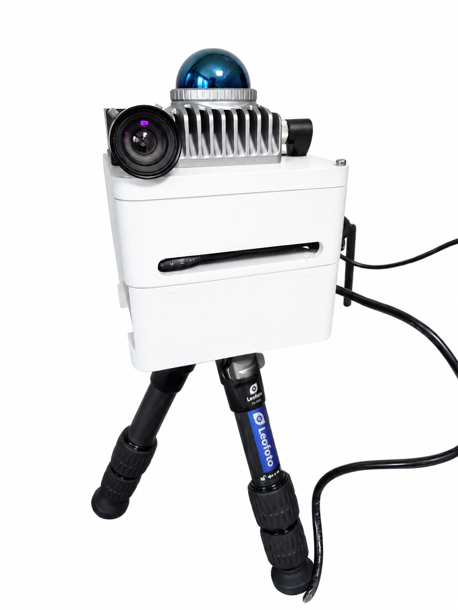
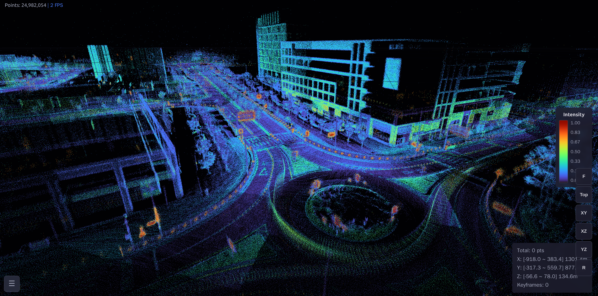

  
  
  

---

## About

Robotics engineer based in **Daejeon, South Korea**, building full-stack autonomous mobile robot systems — from SLAM-based localization to fleet-level coordination.

<table>
<tr>
<td width="50%">

### Industry Experience
- Deployed **30+ AMRs** across a **23,000 m²** logistics center
- Full-stack AMR development: SLAM, navigation, FMS
- Multi-agent path finding for warehouse fleets
- Handheld 3D mapping device development

</td>
<td width="50%">

### Platforms
- Serving Robots
- AMR (Autonomous Mobile Robots)
- Mecanum-wheel Platforms
- AMMR (Autonomous Mobile Manipulation Robots)

### Clients
- **KAI** (Korea Aerospace Industries)
- Large-scale logistics centers

</td>
</tr>
</table>

---

## What I Work On

| Domain | Description |
|:------:|:------------|
| **LiDAR SLAM** | 2D/3D SLAM for mobile robots & handheld mapping devices |
| **Navigation** | Autonomous navigation with MAPF for warehouse AMR fleets |
| **Fleet Management** | FMS coordinating 30+ robots in large-scale operations |
| **3D Vision** | Structured light, depth camera calibration, real-time segmentation, robotic shoe bonding |
| **Industrial AMR** | End-to-end deployment at KAI and large-scale logistics centers |

---

## Tech Stack

  

| Domain | Tools & Libraries |
|--------|-------------------|
| **SLAM** | LIO-SAM, FAST-LIO2, A-LOAM, Point-LIO, VINS-Mono |
| **Optimization** | GTSAM, Scan Context |
| **Point Cloud** | PCL, Open3D |
| **Vision** | OpenCV, Meta SAM 2.1, Zivid SDK |
| **Hardware** | Velodyne, Livox, FLIR Blackfly, Luxonis OAK-D, u-blox GPS |

---

## Featured Projects

<table>
<tr>
<td width="50%" valign="top">

### 🔒 HandheldSLAM
Handheld 3D mapping device with real-time LiDAR SLAM for large-scale environments
  
  

</td>
<td width="50%" valign="top">

### [WebPointCloud](https://github.com/warhammer50K/WebPointCloud) 
Web-based 3D point cloud viewer & analysis tool — no install, runs in the browser. Supports LAS, LAZ, PLY, PCD, XYZ, PTS
 
  

</td>
</tr>
<tr>
<td width="50%" valign="top">

### [sam2-oakd-realtime](https://github.com/warhammer50K/sam2-oakd-realtime) 
Real-time object segmentation with Meta SAM 2.1 + OAK-D Lite via FastAPI
  

</td>
<td width="50%" valign="top">

### [blackfly-gige-viewer](https://github.com/warhammer50K/blackfly-gige-viewer) 
FLIR Blackfly GigE camera viewer using Spinnaker SDK (C++17)
  

</td>
</tr>
<tr>
<td width="50%" valign="top">

### [YouTube: @SJY_Robotics](https://www.youtube.com/@SJY_Robotics)
Demo videos of AMRs and SLAM systems in action
 

</td>
<td width="50%" valign="top">

</td>
</tr>
</table>

---

## GitHub Stats

  
  

  

  

---

  &nbsp;
  &nbsp;
  

