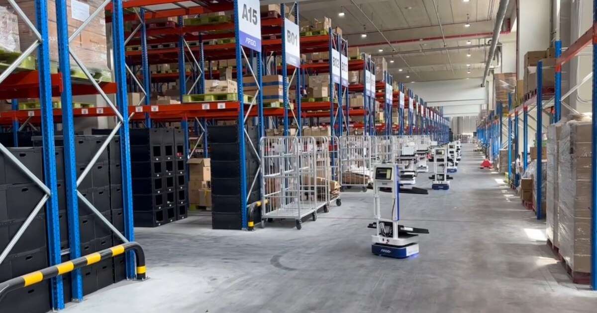
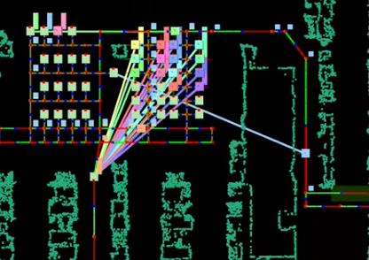
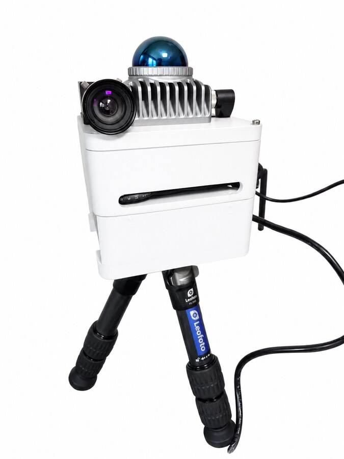
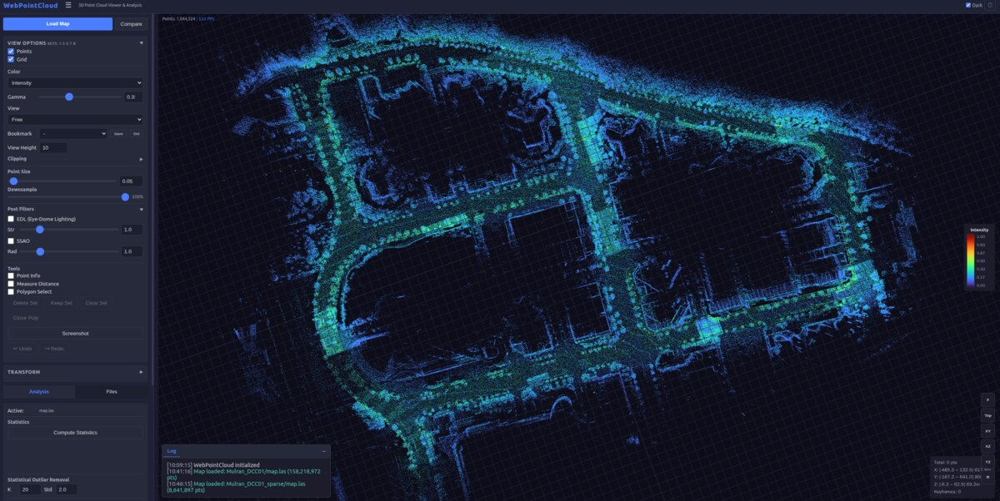

# Jaeyeol Song

**Robotics Engineer — LiDAR SLAM · Autonomous Navigation · Multi-Agent Fleet Systems**

<p align="center">
  
  
  
</p>

I build autonomous mobile robot systems end to end — from LiDAR-inertial SLAM and localization to fleet-level coordination. I implement SLAM front-ends and back-ends from the equations up — ESIKF, on-manifold optimization, analytically derived ICP Jacobians — and I'm currently working on degeneracy-aware LiDAR-inertial odometry for solid-state sensors.

In industry since 2022: 30+ AMRs deployed across a 23,000 m² logistics center, precision drilling automation for aerospace manufacturing, and a handheld 3D mapping device built from the ground up.

Based in Daejeon, South Korea.

---

## Selected Work

### HandheldSLAM <sub>(private)</sub>

Handheld 3D mapping device with real-time LiDAR SLAM for large-scale environments — custom hardware and the full software pipeline.

<p>
  
  
</p>

▶ **[Watch it in action — real-time mapping demo](https://www.youtube.com/watch?v=pV2-1DkV4U4&t=122s)**

### [eskf-lio-core](https://github.com/warhammer50K/eskf-lio-core)

The localization core of HandheldSLAM, open-sourced — an iterated error-state Kalman filter (18-dim state, on-manifold update, motion deskewing) written from the equations up, with the full derivation in the README. Ships a real Livox Mid-360 recording with ground truth: **1.4 cm ATE RMSE** out of the box.


<details>
<summary>Reproduce this result yourself</summary>

```bash
git clone https://github.com/warhammer50K/eskf-lio-core && cd eskf-lio-core
cmake -B build -DCMAKE_BUILD_TYPE=Release && cmake --build build -j
tools/get_example_data.sh                        # real Mid-360 recording + map (~135 MB)
./build/eskf_lio_core example_data/params.json   # → trajectory.txt
python3 tools/plot_trajectory.py trajectory.txt \
    --map example_data/eskf-lio-example/map.ply \
    --gt  example_data/eskf-lio-example/gt_keyframes.txt   # → trajectory.png + ATE
```

Dependencies: Eigen3, Sophus, TBB, spdlog, nlohmann-json (and matplotlib for the plot).
</details>

### [WebPointCloud](https://github.com/warhammer50K/WebPointCloud)

Web-based 3D point cloud viewer and analysis tool. No install, runs in the browser — LAS, LAZ, PLY, PCD, XYZ, PTS.



### [imu-allan-calibration](https://github.com/warhammer50K/imu-allan-calibration)

IMU noise characterization via Allan variance — extracts noise density and bias instability parameters for SLAM frameworks (GTSAM, LIO-SAM, FAST-LIO).

### [sam2-oakd-realtime](https://github.com/warhammer50K/sam2-oakd-realtime)

Real-time object segmentation with Meta SAM 2.1 on an OAK-D Lite, served via FastAPI.

### [blackfly-gige-viewer](https://github.com/warhammer50K/blackfly-gige-viewer)

FLIR Blackfly GigE camera viewer built on the Spinnaker SDK, C++17.

### [UDPCOMM](https://github.com/warhammer50K/UDPCOMM)

Single-header, dependency-free C++11 library for exchanging plain structs over UDP — typed send/receive, framing, background receive thread. Born from joystick-to-robot teleoperation.

▶ Robots in action: [YouTube @SJY_Robotics](https://www.youtube.com/@SJY_Robotics)

---

## Industry (2022–present)

- **Warehouse AMR fleet** — 30+ robots in a 23,000 m² logistics center: SLAM-based localization, autonomous navigation, multi-agent path finding, and the fleet management system coordinating them.
- **Aerospace manufacturing** — precision drilling automation.
- **3D vision** — structured light, depth camera calibration, real-time segmentation, robotic shoe bonding.
- **Platforms** — serving robots, AMR, mecanum-wheel platforms, AMMR (mobile manipulation).

---

## Tech

| | |
|--|--|
| **SLAM** <sub>studied / re-implemented</sub> | FAST-LIO2, LIO-SAM, Point-LIO, A-LOAM |
| **Libraries** | GTSAM, PCL, Open3D, Eigen |
| **Place Recognition** | Scan Context |
| **Vision** | OpenCV, Meta SAM 2.1, Zivid SDK |
| **Hardware** | Velodyne, Livox, FLIR Blackfly, Luxonis OAK-D, u-blox GPS |
| **Stack** | C++, Python, ROS, Qt, Docker, Linux |

---

## Contact

[pixvnt151@gmail.com](mailto:pixvnt151@gmail.com) · [YouTube](https://www.youtube.com/@SJY_Robotics) · Daejeon, South Korea
